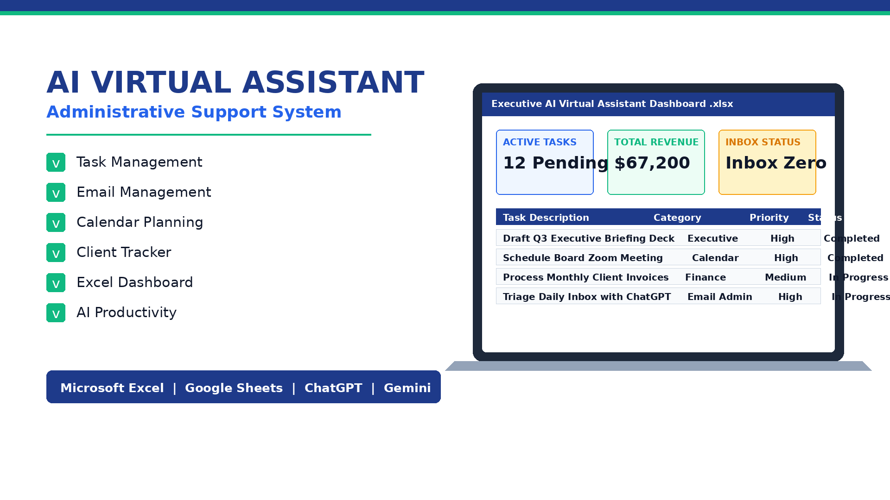

# 🤖 AI Virtual Assistant Dashboard & Administrative Support System



## 📌 Project Overview
An executive-level **AI Virtual Assistant & Administrative Support System** designed to streamline task management, client tracking, email triage, calendar scheduling, and workflow automation. Built using **Microsoft Excel, Google Workspace, Microsoft Word**, and optimized with **ChatGPT & Gemini AI**.

---

## 🛠️ Included System Modules & Files

| File Name | Format | Description & Purpose |
| :--- | :--- | :--- |
| `AI_Virtual_Assistant_Dashboard.xlsx` | `.xlsx` | **Master Combined Workbook** containing all 6 administrative tracking tabs |
| `01_Task_Manager.xlsx` | `.xlsx` | Interactive Task Manager with priority indicators, due date trackers & AI tool tags |
| `02_Daily_Planner.xlsx` | `.xlsx` | Executive Daily Time-Blocking Planner with prompt logging & task status |
| `03_Weekly_Planner.xlsx` | `.xlsx` | Strategic Weekly Overview tracking key deliverables & focus areas |
| `04_Client_Tracker.xlsx` | `.xlsx` | CRM & Pipeline Tracker with contract values, pipeline stages & follow-ups |
| `05_Email_Tracker.xlsx` | `.xlsx` | Email Triage System categorizing urgent inquiries, actions & ChatGPT/Gemini draft status |
| `06_Project_Tracker.xlsx` | `.xlsx` | Multi-Project Budget & Progress Tracker with health metrics |
| `07_Meeting_Notes.docx` | `.docx` | Professional Executive Board Meeting Minutes synthesized with AI assistance |
| `08_Workflow.pdf` | `.pdf` | Standard Operating Procedure (SOP) & Administrative Automation Architecture |
| `09_Cover.png` | `.png` | High-resolution portfolio graphic banner (1920×1080) |

---

## ⚡ Skills Demonstrated
* **Administrative & Executive Support:** Inbox Zero management, Calendar optimization, Meeting Minutes synthesis.
* **Excel & Google Sheets Mastery:** Dynamic formatting, data validation, status indicators, clean visual hierarchy.
* **AI Productivity Tools:** Prompt engineering with **ChatGPT** and **Google Gemini** for executive drafting, document synthesis, and automated email triage.
* **Standard Operating Procedures (SOP):** Structuring clear administrative workflows and security guidelines.

---

## 🚀 GitHub Directory Structure
```text
Portfolio/
└── AI-Virtual-Assistant-Dashboard/
    ├── README.md
    ├── 09_Cover.png
    ├── AI_Virtual_Assistant_Dashboard.xlsx
    ├── 01_Task_Manager.xlsx
    ├── 02_Daily_Planner.xlsx
    ├── 03_Weekly_Planner.xlsx
    ├── 04_Client_Tracker.xlsx
    ├── 05_Email_Tracker.xlsx
    ├── 06_Project_Tracker.xlsx
    ├── 07_Meeting_Notes.docx
    └── 08_Workflow.pdf
